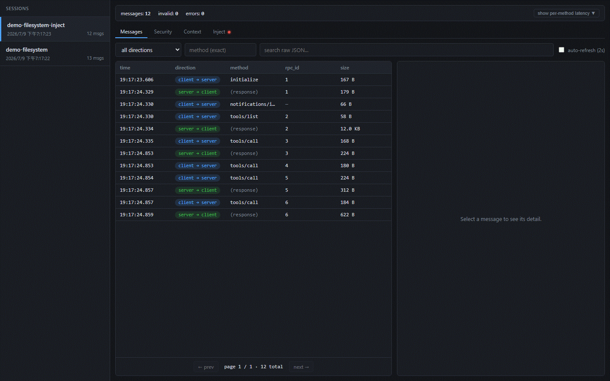
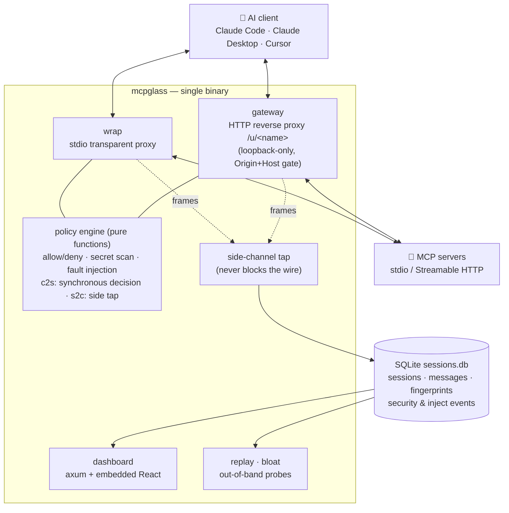

# mcpglass

> **Wireshark + firewall for MCP traffic** — a transparent proxy in a single Rust binary that sits
> between any AI client (Claude Code, Claude Desktop, Cursor, ...) and your MCP servers.
> Debugging, observability, auditing, and security. All data stays on your machine.

<p align="center"></p>

[](https://github.com/q86865511/mcpglass/actions/workflows/ci.yml)
[](Cargo.toml)
[](crates/cli)
[](https://modelcontextprotocol.io/)
[](docs/security-model.md)
[](LICENSE)

> Your client and your MCP servers are having a conversation you can't see. mcpglass records it —
> every request, response, and notification — flags servers that silently rewrite their tools,
> measures what their schemas cost you in context, and can replay or sabotage traffic on demand.

- 🔍 **See the real wire** — not a side-channel test harness: the actual frames your client exchanges with your servers, both stdio and Streamable HTTP
- 🛡️ **Fail-open by design** — the proxy's own bugs, full disks, or panics never block or delay your traffic; observation is a side-channel tap
- 🏠 **Local-first** — one binary, one SQLite file, a loopback-only dashboard; nothing is sent anywhere

**Status**: v0.1.1 — stdio + HTTP interception through MCP spec 2025-11-25, one-command config
takeover, dashboard, security layer (fingerprint pinning incl. `outputSchema` / secret detection /
allow-deny), context bloat analytics, request replay, fault injection, prebuilt binaries.
See [CHANGELOG.md](CHANGELOG.md).

## Table of contents

- [What is mcpglass](#what-is-mcpglass)
- [✨ Highlights](#-highlights)
- [🏗️ Architecture](#️-architecture)
- [🚀 Quick start](#-quick-start)
- [🧭 CLI at a glance](#-cli-at-a-glance)
- [🛡️ Security layer](#️-security-layer)
- [🔬 Debugging toolbox](#-debugging-toolbox)
- [🧪 Development and testing](#-development-and-testing)
- [Project structure](#project-structure)
- [⚠️ Known limitations](#️-known-limitations)
- [📄 License](#-license)
- [Documentation index](#documentation-index)

## What is mcpglass

MCP clients and servers talk over stdio pipes or HTTP — and that conversation is invisible. The
official MCP Inspector is a separate test harness: it talks to your server *itself*, so it can't
show you what your **real client** actually sent, what the server actually answered, or when a
server quietly changed a tool description after you approved it (a rug-pull).

mcpglass is a **transparent proxy** you insert in one command. `mcpglass attach` rewrites your
client's config so every existing server runs through the proxy (with backups; `detach` restores).
From then on every frame is recorded into a local SQLite file and browsable in an embedded React
dashboard: per-session timelines, payload inspection, per-method latency, security alerts, context
cost, and injected-fault history.

The design stance is **fail-open**: mcpglass considers your traffic sacred. Parse failures, a full
disk, a poisoned lock, a panicking policy engine — none of it may block or delay the bytes flowing
between client and server. The only deliberate interventions are the ones you explicitly opt into:
`enforce`-mode policy blocks (answered as legal in-protocol JSON-RPC errors, never a severed
connection) and fault injection you configure yourself.

## ✨ Highlights

- **Transparent stdio interception** — `mcpglass wrap -- <server command>` runs any stdio MCP
  server with zero behavior change; recording is a side-channel tap that never applies backpressure
  to the wire.
- **Streamable HTTP gateway** — `mcpglass gateway` is a local reverse proxy for url-type servers
  (MCP spec through 2025-11-25): JSON and SSE responses stream through untouched while being
  recorded;
  policy applies per request; loopback-only with Origin + Host validation against DNS rebinding.
- **One-command takeover** — `mcpglass attach [claude-code|claude-desktop|cursor|all]` rewrites
  client configs (stdio servers get wrapped, url servers get repointed at the gateway with their
  upstream recorded in `gateway.toml`); atomic writes, timestamped backups, `--dry-run` preview,
  `detach` to restore.
- **Rug-pull detection** — every `tools/list` response is fingerprinted (canonical-JSON SHA-256,
  keyed to the server identity across sessions); a changed tool definition raises a
  `fingerprint_change` alert, including A→B→A oscillations.
- **Secret-leak detection** — outgoing `tools/call` arguments are scanned for AWS / GitHub /
  OpenAI / Anthropic / Slack / Google keys, PEM blocks, JWTs, and your own custom regexes.
- **Monitor first, enforce opt-in** — the default mode only observes and flags. `enforce` refuses
  denied or leaking calls with a synthesized in-protocol JSON-RPC error; proxy-internal failures
  still always fail open.
- **Context bloat analytics** — heuristic token costing (~4 chars/token) of every server's tool
  schemas: totals, fattest-tool ranking, over-long description flags — CLI report or dashboard tab.
- **Request replay** — re-send any recorded client→server request against a freshly spawned server
  (stdio) or a re-initialized session (HTTP) and inspect the response; strictly out-of-band and
  never recorded.
- **Fault injection** — a TOML ruleset simulates faults on live traffic (delay, synthetic error,
  dropped frame, truncation) in either direction, with probabilities and trigger caps, to test
  client/server resilience; injected events get their own dashboard tab.
- **Honest storage** — the SQLite file records full raw traffic *verbatim* (that is the point of a
  traffic recorder), disclosed loudly rather than hidden; secret masking applies to the audit view.

## 🏗️ Architecture

Five workspace crates, one binary. Both transports share the same tap → storage → dashboard
pipeline; the only synchronous element on the hot path is the pure-function client→server policy
decision — everything else observes from the side.



The full design stance — what fail-open guarantees, its three deliberate exceptions, and the
threat model — is in [docs/security-model.md](docs/security-model.md).

## 🚀 Quick start

### Download a prebuilt binary

Grab the archive for your platform from the [latest release](https://github.com/q86865511/mcpglass/releases/latest)
(Linux x86_64, Windows x86_64, macOS Apple Silicon, macOS Intel), then verify and extract it:

```sh
# Verify the download against the release's SHA256SUMS.
sha256sum -c SHA256SUMS --ignore-missing

# Optional: verify the GitHub Actions build provenance attestation.
gh attestation verify mcpglass-v0.1.1-x86_64-unknown-linux-gnu.tar.gz --owner q86865511

tar -xzf mcpglass-v0.1.1-x86_64-unknown-linux-gnu.tar.gz
cd mcpglass-v0.1.1-x86_64-unknown-linux-gnu
./mcpglass --help
```

On macOS, clear the quarantine attribute before the first run or Gatekeeper will refuse to launch
the binary:

```sh
xattr -d com.apple.quarantine ./mcpglass
```

Then move `mcpglass` (or `mcpglass.exe`) onto your `PATH`. See [docs/RELEASING.md](docs/RELEASING.md)
for how releases are built.

<details>
<summary>Build from source instead</summary>

You need a [Rust toolchain](https://rustup.rs/) (1.86+) and [pnpm](https://pnpm.io/) (the dashboard
frontend is embedded into the binary at build time):

```sh
git clone https://github.com/q86865511/mcpglass
cd mcpglass

# 1. Build the dashboard frontend first — cargo embeds its output.
#    Skip this and you get a placeholder dashboard page.
cd crates/dashboard/frontend && pnpm install && pnpm build && cd ../../..

# 2a. Build the binary into ./target/release/mcpglass
cargo build --release --workspace

# 2b. ...or install it onto your PATH
cargo install --path crates/cli
```

</details>

Then point your client's existing MCP servers through the proxy and watch:

```sh
# 1. Rewrite the client config so its servers run through mcpglass (a backup is
#    written first; `mcpglass detach` restores). Use --dry-run to preview.
mcpglass attach claude-code

# 2. Use Claude Code as usual — every request/response is now recorded locally.

# 3. Open the dashboard timeline at http://127.0.0.1:7411
mcpglass dashboard
```

For url-type (Streamable HTTP) servers, also run the long-lived gateway that `attach` repoints
them at: `mcpglass gateway`. Want traffic to look at without touching a real client? A scripted,
reproducible demo lives in [`scripts/demo.ps1`](scripts/demo.ps1) (see [docs/demo.md](docs/demo.md)).

## 🧭 CLI at a glance

| Command | What it does |
| --- | --- |
| `mcpglass wrap -- <cmd>` | Run a stdio MCP server through the transparent proxy (`--policy`, `--enforce`, `--inject`) |
| `mcpglass gateway` | Long-lived reverse proxy for Streamable HTTP servers (`/u/<name>`, default port 7412) |
| `mcpglass attach [target]` | Rewrite client configs to route servers through the proxy (backup + `--dry-run`) |
| `mcpglass detach [target]` | Undo `attach`: unwrap stdio entries, repoint url entries at their original upstream |
| `mcpglass dashboard` | Serve the local web dashboard (default port 7411, loopback-only) |
| `mcpglass replay <message-id>` | Re-send a recorded request out-of-band and print the response |
| `mcpglass bloat` | Context-cost report of every server's tool schemas (fattest tools, trim hints) |

Every flag and example: [docs/cli.md](docs/cli.md). Policy and fault-injection TOML reference:
[docs/configuration.md](docs/configuration.md).

## 🛡️ Security layer

`mcpglass wrap --policy <file>` (and the gateway alike) enforces a TOML policy:

- **Tool integrity pinning** — fingerprints each server's tool definitions and alerts on any
  change across runs (rug-pull detection).
- **Secret-leak filtering** — flags `tools/call` arguments carrying API keys/tokens; values are
  masked in the audit view (the raw traffic log stores payloads verbatim).
- **Per-tool allow/deny** — deny wins and supports a trailing `*` prefix wildcard; allow entries
  are exact matches.
- **Append-only audit log** — every decision recorded, surfaced in the dashboard's Security tab.

Default mode is **monitor** (observe and flag, never block). Opt into **enforce** (`--enforce` or
`mode = "enforce"`) to actively refuse denied/leaking calls: the client receives an in-protocol
JSON-RPC error instead of a severed connection, and any proxy-internal error still fails open.

> **Privacy note:** the local SQLite database records **full raw traffic**, including any secret
> that flows through it. This is by design (it is a traffic recorder) and the data never leaves
> your machine. Treat `sessions.db` as sensitive. Details: [docs/security-model.md](docs/security-model.md).

## 🔬 Debugging toolbox

- **Context bloat analysis** — `mcpglass bloat` (or the dashboard's Context tab) estimates what
  each server's `tools/list` schemas cost in tokens, ranks the heaviest tools, and lists trim
  candidates. Counts are a ~4 chars/token heuristic, not an exact tokenizer.
- **Request replay** — `mcpglass replay <message-id>` (or the dashboard's Replay button)
  re-spawns the stdio server — or re-initializes the HTTP upstream for a fresh session — and
  re-sends the recorded request. Out-of-band, read-only, never recorded; it *can* trigger real
  side effects, so the dashboard asks for confirmation first.
- **Fault injection** — `--inject <file>` on `wrap` or `gateway` applies rules like *"delay the
  first `tools/call` by 500 ms"* or *"answer the second one with a synthetic error"*: delay /
  error / drop / truncate, per direction, with probability and `max_triggers` caps. Off by
  default; injected events land in the dashboard's Inject tab. SSE response streams are not
  injected in this version.

## 🧪 Development and testing

```sh
cargo build --workspace          # build all five crates
cargo test  --workspace          # 200+ unit & integration tests (proxy passthrough is byte-exact)
cargo clippy --workspace -- -D warnings
cd crates/dashboard/frontend && pnpm build    # tsc strict + vite, embedded via rust-embed
```

CI runs all of the above on Ubuntu and Windows for every push and PR
([.github/workflows/ci.yml](.github/workflows/ci.yml)). Frontend development against fixture data
without a real proxy: `pnpm mock` + `pnpm dev`. Contribution conventions:
[CONTRIBUTING.md](CONTRIBUTING.md) · vulnerability reports: [SECURITY.md](SECURITY.md).

## Project structure

```
crates/
  proxy-core/     JSON-RPC parsing, framing, SSE splitting, MCP version constants, bloat heuristics
  policy/         pure decision logic — policy / secrets / fingerprints / fault injection (no IO)
  storage/        rusqlite store (schema v5): sessions, messages, fingerprints, security & inject events
  cli/            the mcpglass binary: wrap / attach / detach / gateway / replay / bloat + the tap hot path
  dashboard/      axum REST API + rust-embed'ed React frontend
    frontend/     React + TypeScript (pnpm; `pnpm build` output is embedded at compile time)
docs/             user documentation (CLI, configuration, security model, demo guide)
scripts/          reproducible end-to-end demo (demo.ps1 / demo.sh + assets)
```

## ⚠️ Known limitations

- **Raw traffic is stored in plaintext** — including secrets that flow through. Deliberate and
  loudly disclosed (see the privacy note above); secret masking applies to the audit view only.
- **Token counts are heuristic** — `bloat` estimates ~4 chars/token and says so; it is for finding
  outliers, not billing.
- **SSE streams are recorded but not injected/replayed** — fault injection and replay skip HTTP
  SSE response streams in this version.
- **Notification error-injection differs per transport** — injecting `error` on an id-less frame
  sends nothing on stdio but answers `id: null` through the HTTP gateway (a known asymmetry).
- **Platform coverage** — developed and manually tested on Windows; Ubuntu + Windows covered by
  CI; macOS is untested (no known blockers — reports welcome).
- **Opening an old database can upgrade it** — read paths never destructively migrate, but they may
  apply additive schema upgrades to a database created by an older mcpglass.

## 📄 License

Apache-2.0 — see [LICENSE](LICENSE).

## Documentation index

| Document | Contents |
| --- | --- |
| [docs/cli.md](docs/cli.md) | Every subcommand, its flags, examples, and caveats |
| [docs/configuration.md](docs/configuration.md) | Policy TOML and fault-injection TOML reference |
| [docs/security-model.md](docs/security-model.md) | Fail-open design, monitor/enforce, threat model, data disclosure |
| [docs/demo.md](docs/demo.md) | Scripted demo, screenshot/GIF recording pipeline |
| [CHANGELOG.md](CHANGELOG.md) | Release history (Keep a Changelog) |
| [CONTRIBUTING.md](CONTRIBUTING.md) | Build/test/lint workflow and PR conventions |
| [SECURITY.md](SECURITY.md) | Vulnerability reporting |
